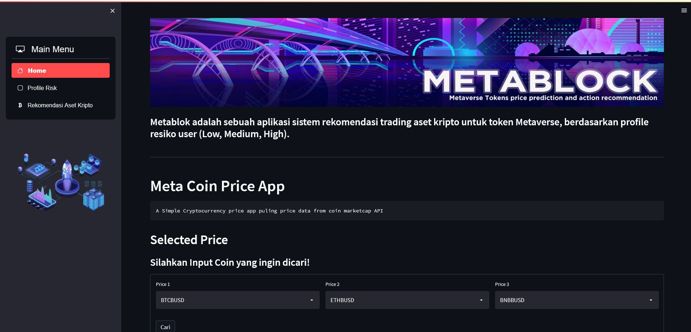
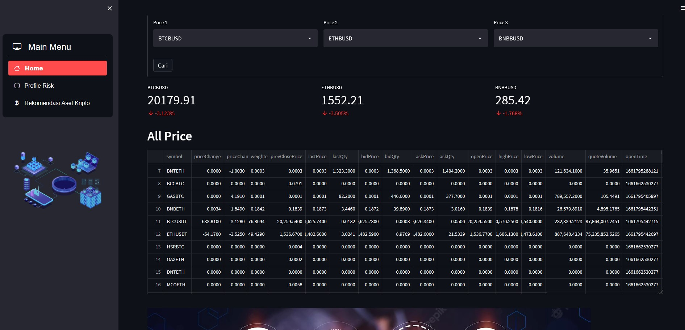
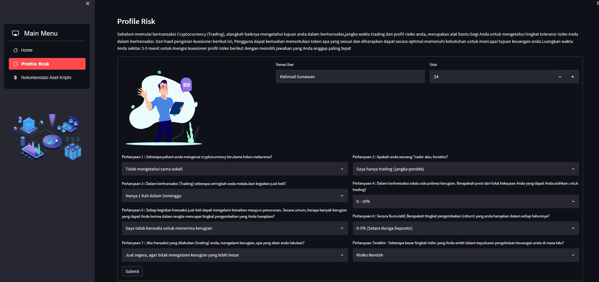
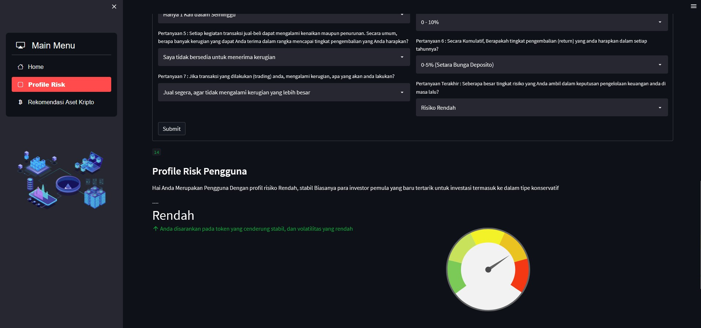
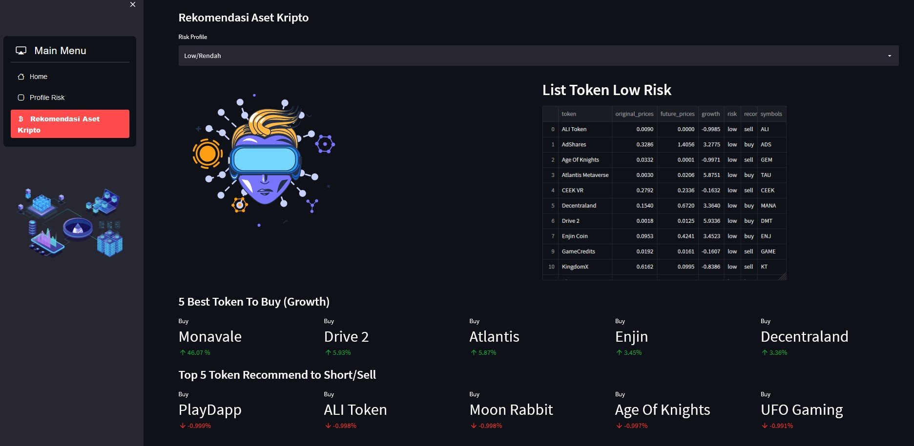
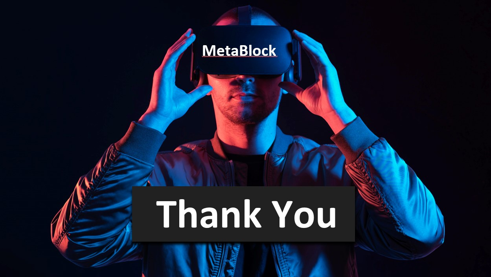

# MetaBlock!
**We Help You Navigate Through The Metaverse With AI**

  

<h3 align="center">Metablock </h3>

## Dashboard

The dataset Metaverse Crypto Tokens Historical data, Top leading and buzzing metaverse tokens

**MetaBlock!** adalah sebuah aplikasi sistem rekomendasi trading aset kripto untuk token Metaverse, berdasarkan profile resiko user (Low, Medium, High)..

## Latar Belakang

The app provides AI-based recommendation system to invest in metaversal tokens. Problems is to be solved include:
Metaversal token has high volatility and AI may help in managing investment risk
There are hundreds of metaversal tokens in the market and it is difficult to keep track of those asset classes. AI may help in automating some of the processes and monitoring those coins

There are a high degree of frauds occurring in the metaverse. The app helps you select tokens that have lower risk

## Demo Aplikasi

  
  

  Tampilan dari laman beranda

  
  

  Tampilan dari laman beranda

---
Untuk menggunakan aplikasi cukup mudah, terdapat 3 navigation page yaotu 'Home', 'Profile Risk' dan 'Rekomendasi Aset Kripto’ Pada page Home , user dapat mengetahui harga token/coin crypto, hingga saat ini kami masih menggunakan API Binance, jadi bukan hanya token metaverse namun juga terdapat beberapa koin lainnya seperti BTC,ETH,dll 
Kemudian pada Page Profile Risk user akan diarahkan untuk mengisi profile risk user, dimana terdapat beberapa pertanyaan yang harus diisi oleh user.
Tujuan dari mengisi profile risk adalah untuk mengidentifikasi risk profile user, apakah tergolong dalam kategori rendah,med,tinggi, setelah mengetahui risk profile user tersebut, kita dapat mengetahui koin/token apa saja yang cocok/sesuai dengan risk profile user tersebut. Sehingga user akan lebih nyaman dalam bertransaksi dan kemudian akan mengetahui bagaimana profile risk user tersebut, dan terakhir adalah page Rekomendasi Aset Kripto, dimana user akan diberikan beberapa token yang sesuai dengan profile risk user tersebut.

  
  

  Tampilan dari laman Profile Risk

  
  

  Tampilan dari laman Profile Risk

---

  
  

  Tampilan dari laman skema Rekomendasi Aset

  
  

